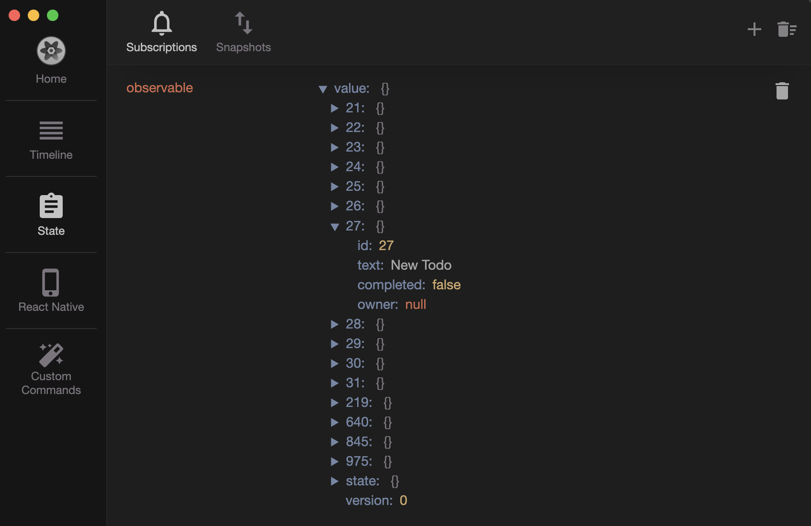

# Reactotron plugin for legend-state library
This plugin integrates Reactotron with the legend-state library, enabling you to monitor state changes directly in Reactotron.

It has been tested with async storage as the storage handler.

## Installation

Using Yarn:
```bash
yarn add reactotron-legendstate-plugin
```

Using npm:
```bash
npm install reactotron-legendstate-plugin
```

## Usage

```javascript
import Reactotron from "reactotron-react-native";
import AsyncStorage from "@react-native-async-storage/async-storage";
import reactotronLegendState from "reactotron-legendstate-plugin";
import observable$ from "path/to/observable";
import { observe } from "@legendapp/state";


Reactotron.setAsyncStorageHandler(AsyncStorage) 
    .configure({
        name: 'Project Name',
    }) 
    .useReactNative() 
    .use(
        reactotronLegendState({
            stores: [
                // Add all observables here
                { name: 'observable', observable: observable$ },
            ],
            observe // Add observe function from legend-state
        })
    ) 
    .connect();
    
```

**Note:** You need to add a new subscription with the store name (in this case, `observable`) under the state tab in Reactotron to monitor state changes.

